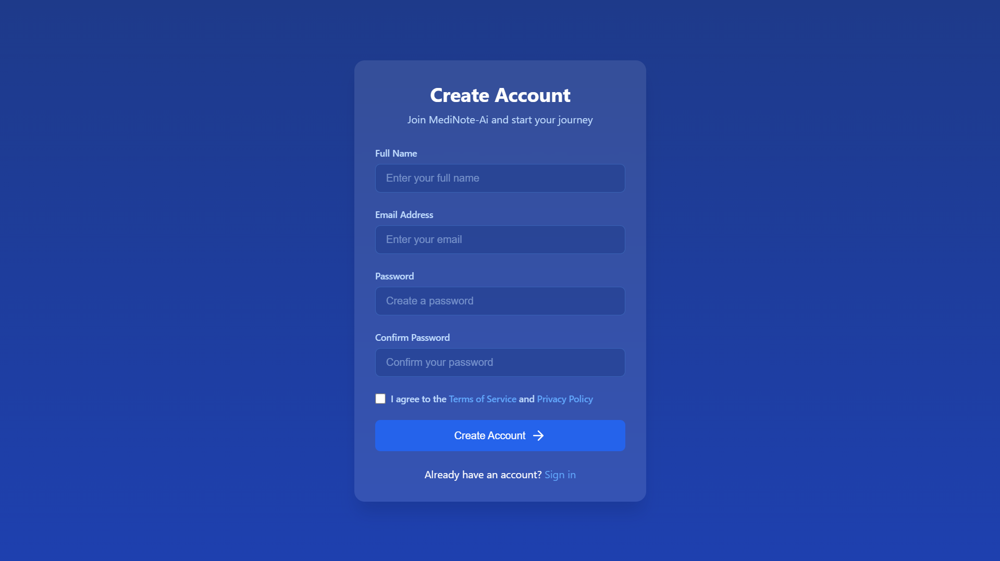
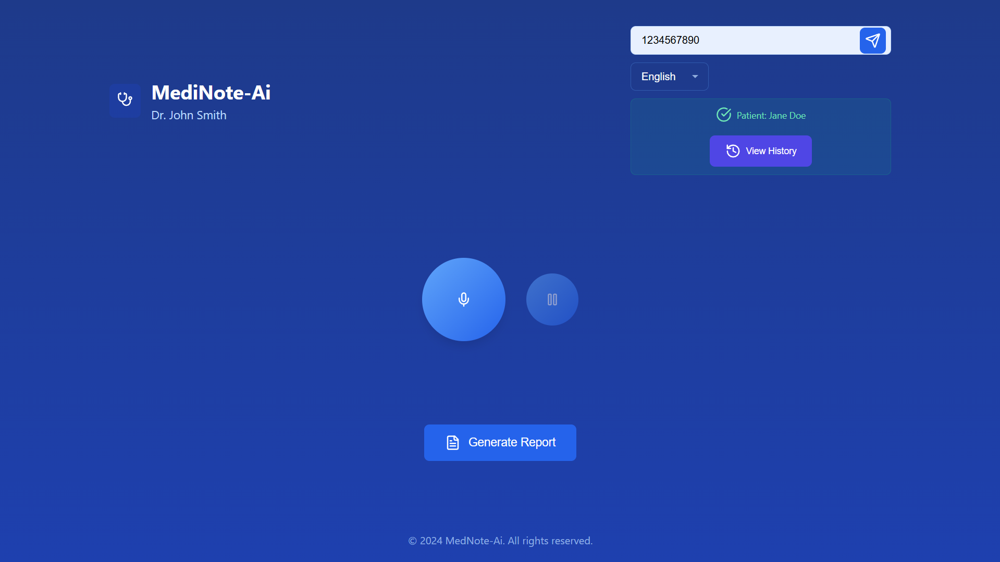
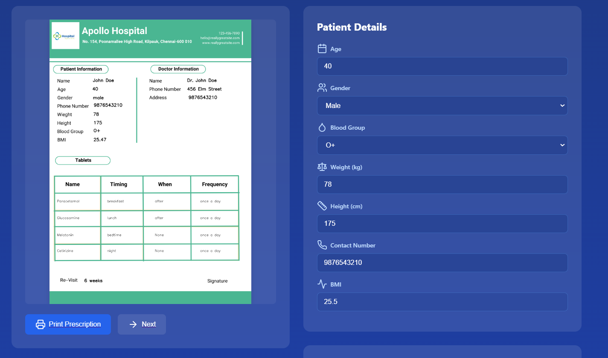

# MediNote-AI  
**Transforming Doctor-Patient Conversations into Automated Medical Reports with AI Precision.**

---

## 🚀 Overview
**MediNote-AI** is an AI-powered web application designed to streamline healthcare documentation by converting doctor-patient conversations into structured, comprehensive medical reports. By leveraging advanced speech-to-text technology and natural language processing (NLP) with models like **GPT-4**, MediNote-AI assists healthcare professionals in generating accurate prescriptions, dietary recommendations, and care instructions while storing data securely for future reference.  

This project was developed during **HackVerse 5.0** to empower doctors and medical institutions with a **smarter, faster, and error-free** approach to patient management.

---

## 🌟 Key Features & USPs (Unique Selling Propositions)

### 🩺 **Automated Medical Report Generation**
- Real-time conversion of doctor-patient conversations into detailed medical reports.  
- AI extracts patient information, symptoms, medications, and care instructions.  

### 📄 **Comprehensive Medical Reports**
- Patient details and contact information.  
- Prescription summaries with dosage instructions.  
- Dietary plans and wellness recommendations.  
- Health metrics (BMI calculations, diabetes risk, etc.).  

### 🧠 **Intelligent Data Management**
- Patient history stored in a **structured JSON database** for easy access.  
- Automatic retrieval of previous health records for continuity of care.  

### 🎙️ **Speech-to-Text Integration**
- Real-time speech recognition for seamless conversation analysis.  
- Multi-language support (English, Tamil, Hindi) for diverse patient bases.  

### 📊 **User-Friendly Interface**
- Clean, intuitive UI designed for doctors with minimal technical knowledge.  
- Mobile-responsive design for accessibility from multiple devices.  

### 🔐 **Security & Compliance**
- **Data privacy** with secure data handling and storage.  
- Compliance with healthcare standards for patient data security.  

---

## 🛠️ Technologies Used

### **Frontend:**
- **HTML, CSS, JavaScript** – Clean, responsive design.  
- **Lucide Icons** for enhanced visual representation.  

### **Backend:**
- **Python (Flask)** – Lightweight backend for data processing.  
- **MongoDB & JSON Storage** – For secure and efficient patient data storage.  
- **Threading in Python** – For concurrent recording and report generation.  

### **AI & Speech Recognition:**
- **OpenAI's GPT-4** – For advanced natural language processing.  
- **SpeechRecognition Library** – For converting audio to text.  

---

## 🎯 How It Works (Workflow)

### **1. Speech Capture and Conversion:**
- Doctor initiates the recording using the **MediNote-AI** web app.  
- Real-time audio capture is converted into text using **SpeechRecognition**.  

### **2. Data Extraction:**
- AI extracts critical data like symptoms, prescribed medications, and care instructions.  

### **3. Report Generation:**
- The system generates a **PDF report** containing:  
   - Patient details.  
   - Prescriptions with dosage.  
   - Dietary plans and care instructions.  

### **4. Data Storage & Management:**
- Patient data is stored securely in a **JSON database**.  
- Patient records can be accessed anytime using **phone number lookup**.  

---

## 💡 Problem It Solves
Healthcare professionals often face:  
- **Manual data entry challenges** leading to errors and inefficiency.  
- **Time-consuming documentation** processes during consultations.  
- **Inconsistent record-keeping**, affecting long-term patient care.  

**MediNote-AI solves these issues by:**  
- Automating **prescription generation** and patient record management.  
- Reducing **administrative workload** for doctors.  
- Providing **faster access** to patient history for better care decisions.  

---

## 🎯 Use Cases  
**MediNote-AI** can be used in:  
- **Hospitals & Clinics** for real-time documentation during consultations.  
- **Telemedicine Platforms** for remote patient monitoring and reporting.  
- **Health Camps** for faster data collection and reporting.  
- **Medical Education** as a tool for teaching efficient patient documentation.  

---

## 🚧 Challenges We Faced  
While building MediNote-AI during **HackVerse 5.0**, we encountered several technical challenges:  

- **Session Management Issues:**  
   - Difficulty maintaining patient sessions across multiple servers.  
   - Resolved using **cross-server API communication** and improved session handling.  

- **Version Control Conflicts:**  
   - Running multiple servers simultaneously caused API conflicts.  
   - Fixed using **cross-origin resource sharing (CORS)** for better synchronization.  

- **Paid API Access:**  
   - Initial reliance on **premium AI models** increased complexity.  
   - Balanced by **combining open-source tools** with premium APIs only for critical tasks.  

---

## 🎯 HackVerse 5.0 Grand Prize Track Fit  
MediNote-AI embodies **innovation and impact**, fitting into the **HackVerse Grand Prize Track** by:  
- **Leveraging Generative AI** for a real-world healthcare solution.  
- **Improving efficiency** in a critical domain—healthcare.  
- **Demonstrating technical depth** with real-time AI integration.  
=======
## Screenshots
### Login Page



---

## 🎯 The Vital Vault: Healthcare Track Fit  
MediNote-AI directly addresses the **Vital Vault Healthcare Track** by:  
- **Automating medical documentation**, reducing errors.  
- **Enhancing patient care** through personalized care instructions.  
- **Providing secure data handling** to protect sensitive medical information.  

---

## 🎯 Product Design Track Fit  
MediNote-AI fits the **Product Design Track** by:  
- **User-Centric Design:** Intuitive UI for both doctors and staff.  
- **Functional Simplicity:** Minimal steps for recording and report generation.  
- **Visual Clarity:** Clean report layouts for easy readability.  

---

## 🎯 Plotch.ai Track Fit  
MediNote-AI utilizes **AI-driven automation** for real-world problem-solving, aligning with the **Plotch.ai** track through:  
- **AI-Generated Insights:** Extracting critical data from conversations.  
- **Real-Time Processing:** Instant data analysis and reporting.  
- **Scalability:** Designed to support multiple patients and clinics.  

---

## 📷 Screenshots  
**Login Page:**  
  

**Patient Analysis:**  
  

**Prescription Preview:**  
  
  

---

## 🧑‍💻 Developers  
- **Siddharth Magesh** – AI Engineer & Backend Developer  
- **Pranesh Kumar** – Full-Stack Developer  
- **Mohamed Yasir** – UI/UX Designer  

---

## 📦 Installation & Usage  
```bash
# Clone the repository
git clone https://github.com/your-repo/MediNote-AI.git  

# Navigate into the directory
cd MediNote-AI  

# Install dependencies
pip install -r requirements.txt 
pip install -r input_requirements.txt 

# Run the server
python app.py  

# Run Second server
python input.py
```
**Access the web app at:** `http://localhost:5000`  

---

## 📈 Future Enhancements  
- **EHR Integration:** Compatibility with electronic health records for broader usage.  
- **Multi-Language Support:** More language options for diverse patient groups.  
- **Mobile App Development:** Expanding to a mobile-friendly version for on-the-go usage.  

---

## 🤝 Contribution  
We welcome contributions! Feel free to submit issues or pull requests on our [GitHub Repo](https://github.com/your-repo/MediNote-AI).  

---

## 📜 License  
This project is licensed under the **MIT License**. See the `LICENSE` file for details.  

---

## 📧 Contact Us  
For inquiries, please contact:  
- 📩 **Email:** support@medinoteai.com  
- 🌐 **Website:** [www.medinoteai.com](https://www.medinoteai.com)  

---  

**Empowering Smarter Healthcare with AI – MediNote-AI**  
